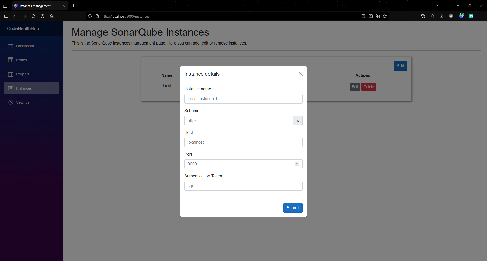

## Running CodeHealthHub with Docker

### Prerequisites
- Docker installed

### Using SQL Server (Persistent Database)
``` shell
docker run -p 5000:80 `
    --name codehealthhub `
    -e DATABASE_CONNECTION_STRING="Server=serveraddress;Database=databasename;User Id=yourusername;Password=yourpassword;TrustServerCertificate=True" `
    -v codehealthhub_keys:/app/keys `
    -d leoohwizvision/codehealthhub:latest
```

### Using .env file
``` shell
docker run -p 5000:80 `
    --name codehealthhub `
    --env-file .env `
    -v codehealthhub_keys:/app/keys `
    -d leoohwizvision/codehealthhub:latest
```

### Docker image link
https://hub.docker.com/r/leoohwizvision/codehealthhub

## Adding SonarQube Instances to CodeHealthHub

### Prerequisites
- SonarQube instance running

### If running in local container
1. Get IP address of instance. If container is named sonarqube:
    - Run `docker inspect sonarqube | Select-String IPAddress` on powershell
    - Run `docker inspect sonarqube | grep IPAddress` on linux
2. Get authentication token for the instance
3. Add connection details

    - Adding will send a ping to the SonarQube, if there is no pong response a error message will pop-up

### If running in another server on the network
1. Get authentication token for the instance
2. Add connection details

    - Adding will send a ping to the SonarQube, if there is no pong response a error message will pop-up

## Populating Database for Dashboard
1. Click 'Projects' in navigation sidebar
2. Click 'Refresh Project Data' button above table
3. Click 'Issues' in navigation sidebar
4. Click 'Refresh Issues Data' button above table
5. Click 'Dashboard' in navigation sidebar
